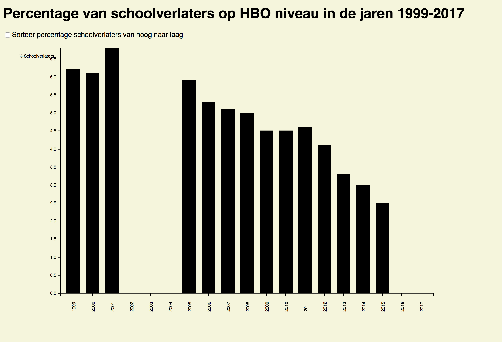

# Assessment 2
Dit is assessment 2 waarbij ik een interactieve visualisatie moest toevoegen in mijn javascript aan de hand van d3.
Hierbij heb ik gekozen voor een sort function waar de grafiek wordt gefilterd op hoogste percentage naar de laagtste percentage.
Hiervoor moest ik ook dirty data gebruiken die ik zelf kon zoeken aan de hand van de bijgeleverde links die ik kon vinden op de github fork van front end 3.

## Bestanden
Om deze assessment 2 te maken heb ik de volgende bestanden gebruikt/gemaakt:
* HTML (index.html)
* Javascript (index.js)
* CSV (data.csv)
* CSS (index.css)
* readme (readme.md)

## Aanpassingen
Hieronder kunt u per bestand zien wat ik zowel heb veranderd.

### HTML
* Alle javascript code weggehaald
* De javascript bestand gelinkt in de html
* Een h1 als titel toegevoegd
* Een body aangemaakt en de svg/javascript hierin gezet
* De title veranderd in @RyanNL1994
* Een checkbox toegevoegd zodat deze de function in de javascript triggerd en de grafiek van hoog naar laag gesorteerd kan worden

### Javascript
* Comments toegevoegd zodat ik beter begrijp wat er gebeurd in de code en de proces hiervan
* Code toegevoegd dat wanneer er op de checkbox wordt geklikt er een functie wordt uitgevoerd die de grafiek veranderd. De verandering is hier dat de percentage van schoolverlaters op HBO niveau wordt gesorteerd van hoog naar laag.
* Transitions toegevoegd met een easeBack en een duration van 1,5 sec waarbij de kleur ook veranderd in blauw. Dit zit in een function en wordt dus pas getriggerd wanneer er op de checkbox wordt geklikt.
* De dataset opgeschoont via code in javascript

### CSV
* Een CSV bestand aangemaakt en hierin de dirty data gezet die ik heb verkregen via de CBS op de volgende link:
http://statline.cbs.nl/Statweb/publication/?DM=SLNL&PA=81573NED&D1=24&D2=0&D3=a&HDR=T&STB=G1,G2&VW=T

### CSS
* De background color van de body heb ik veranderd naar een beige kleur.
* De label heb ik een display block gegeven zodat deze nu boven de svg staat en niet meer ernaast
* De font-family heb ik aangepast naar sans serif zodat ik een schreefloos lettertype krijg.

## Bronnen
Ik heb deze grafiek kunnen maken met dank aan Mike Bostock waarvan ik een groot deel van de code vandaan heb van de grafiek. Deze kan je vinden op de volgende site: https://bl.ocks.org/mbostock/3885304
Ook met dank aan Titus Wormer waar ik de code van heb kunnen inzien voor de sort function via de volgende link: https://cmda-fe3.github.io/course-17-18/class-4/sort/
Samen met de slides van class 4.
Voor het opschonen van de dataset in javascript heb ik veel gehad aan de slides van class 3 en uitleg in een chat van de font end slack van @deshlieee. Samen met hulp van een klasgenoot waarmee ik samen heb gewerkt @duy-linh

## Licentie
Released under the GNU General Public License, version 3.
GPL-3.0 © Titus Wormer
